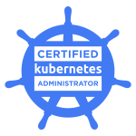

# Hi! I’m Rajshri Mohan

**I build software for a living.**

I currently work with [IQZ Systems](https://iqzsystems.com) here in [Coimbatore, India](https://goo.gl/maps/Z5fL1dgnqRpfJKrK8) as an _Enterprise Technology Architect_. It is a lot of fun and I get to learn a lot.

I also write random stuff [here at my blog](https://rajshrimohanks.me).

## Stuff I love

- Programming _(duh!)_
- [Spotify](https://open.spotify.com/user/21gswm52ozbiyosazhjiepygy?si=PHBmzLFOTNWzk6kIh4FkoA)
- Coffee
- Chocolates
- A R Rahman
- Linkin Park

I’m always up for a nice talk and food. Drop me a message in social media if you’d like to meet up. :-)

Have a good day!

## Certifications

